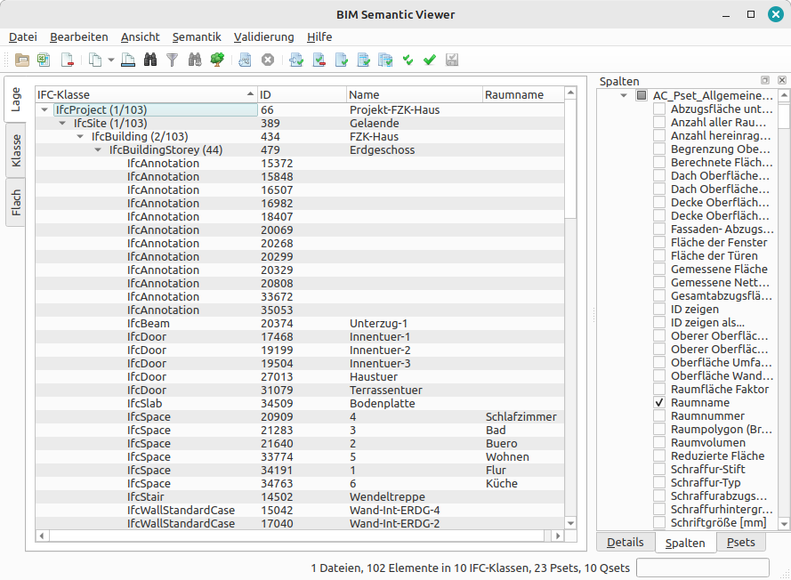

# BIM Semantic Viewer

BIM Semantic Viewer presents the elements of IFC files and their semantics in 
several differently structured tree views. In addition to the predefined views, 
user-defined tree views can also be created. The values of selected attributes 
can be displayed in table columns. A panel on the side shows all the details of 
the selected element. Other panels summarize all property sets or quantity sets 
and the values used in them. It is also possible to validate the data using rules 
defined in IDS files, and an editor for IDS files is also provided.


BIM Semantic Viewer is Open Source under GPL 2. It has been tested on Windows 
and Linux.

> This program has been developed as project in the module "Geoprojektarbeit" at Berliner Hochschule für Technik (BHT)



## Installation 

The provided packages contain executables that can be started with a 
double click without any further installation.

The following sections are about running the source code.
### Python

Python must be installed on the system to run the source code.
The required package IfcOpenShell is compatible with Python 3.9 to 3.12.

### Setup venv
> Note: some requirements are not in conda, it is better to use a Python venv and to install requirements with pip

Create virtual environment in the project root folder
```
python -m venv venv
```

Activate the venv

Linux:
```
source venv/bin/activate
```

Windows Powershell:
```
Set-ExecutionPolicy -ExecutionPolicy RemoteSigned -Scope Process
.\venv\Scripts\Activate.ps1
```

Install requirements
```
pip install -r requirements.txt
```
### Translation
(Commands in the root directory of the project with venv enabled)

Update translations:
```
pyside6-lupdate bimsemantic/ui/*.py -ts bimsemantic/i18n/bimsemantic_de.ts
```

Edit the translations in QtLinguist 
```
pyside6-linguist bimsemantic/i18n/bimsemantic_de.ts
```

and then release translation with:
```
pyside6-lrelease bimsemantic/i18n/bimsemantic_de.ts
```

### Resources

Icons have to be added to resources.qrc. This file is compiled with:

```
pyside6-rcc resources.qrc -o resources.py
```


### Packaging with PyInstaller
This section explains how to create a package with PyInstaller.

With activated venv:
```
pip install PyInstaller
```

PyInstaller uses a spec file for configuration.
To create a spec file for a project, run the following commands with activated venv. **Note: use one of the provided spec files instead!**
```
cd bimsemanticviewer
pyinstaller app.py
```

The spec file has to be edited: Hidden imports and required files such as the
IFC rules and ids.xsd have to be packaged as well. The source code contains the edited 
files for windows (`app.spec.windows`) and Linux (`app.spec.linux`).

Now run
```
pyinstaller app.spec
```
And the exe will be in the `dist` folder

In case of any problems, try:
```
pip3 install --upgrade PyInstaller pyinstaller-hooks-contrib
```

Note to self: git pull with github cli: gh repo sync

